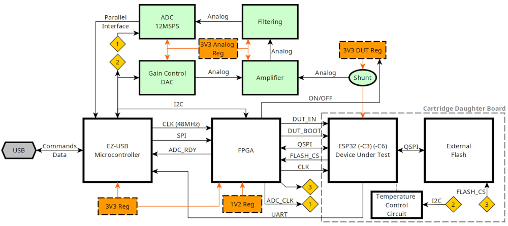

# ESP CPA

This repository contains the firmware, gateware, and host software of the _ESP CPA Board_.


This board is aimed at exploring side-channel attacks against some _Espressif_ chips. More details are available in [this blog post](https://courk.cc/breaking-flash-encryption-of-espressif-parts).



# Installation

The [sdcc](https://sdcc.sourceforge.net/) compiler is required to build the firmware of the [FX2LP](https://www.infineon.com/cms/en/product/universal-serial-bus/usb-2.0-peripheral-controllers/ez-usb-fx2lp-fx2g2-usb-2.0-peripheral-controller/) microcontroller.

To configure the _FPGA_, the [yosys](https://github.com/YosysHQ/yosys) synthesis tool, and [nextpnr](https://github.com/YosysHQ/nextpnr) place and route tool are also needed.

_Python_ dependencies can be installed by running `poetry install`.

Finally, this project relies on a custom _Rust_ library for computationally intensive tasks. A valid `rustc` compiler installation is expected. The library can be compiled with:

```
RUSTFLAGS='-C target-cpu=native' poetry run maturin develop -r
```

# Host Software Overview

## Board Configuration

The _ESP CPA Board_ needs to be configured with the `poetry run ctrl configure-board` command.

This command flashes the firmware of the `FX2LP` microcontroller and configures the _FPGA_.

More options are available from the output of the `poetry run ctrl --help` command.

## Power Traces Measurement

`poetry run measure` is used to capture power traces.

Example:

```
poetry run measure config/capture/esp32c3.py test.zarr
```

More options are available from the output of `poetry run measure --help`.

## Traces Analysis

_Correlation Power Analysis_ methods can be applied with the `poetry run analyze` tool. All subcommands are available from the output of `poetry run analyze --help`.

Results can be plotted thanks to the `poetry run plot` commands.

## Miscellaneous

The `poetry run key-tools` utility is useful for computing various key-related values. This is beneficial when evaluating the _XTS_ mode of encryption. See [this](https://courk.cc/breaking-flash-encryption-of-espressif-parts#encryption-method-overview_1) for theoretical details.